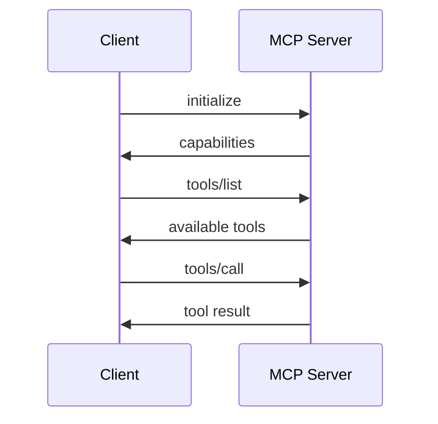
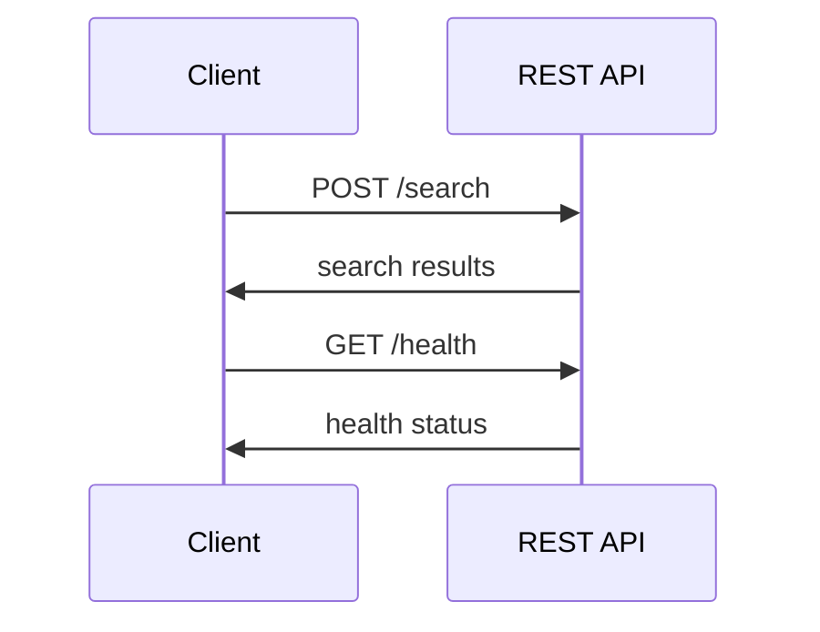

# MCP Setup Guide: Standard vs RESTful API Approach

This guide compares typical MCP (Model Context Protocol) setup patterns with RESTful API integration approaches.

## Table of Contents
- [Standard MCP Setup](#standard-mcp-setup)
- [RESTful API Integration](#restful-api-integration)
- [Hybrid Approach](#hybrid-approach)
- [Configuration Comparison](#configuration-comparison)
- [Best Practices](#best-practices)

## Standard MCP Setup

### 1. MCP Server Registration

**File: `mcp_servers.json`**
```json
{
  "mcpServers": {
    "filesystem": {
      "command": "npx",
      "args": ["-y", "@modelcontextprotocol/server-filesystem", "/path/to/files"],
      "env": {}
    },
    "github": {
      "command": "npx", 
      "args": ["-y", "@modelcontextprotocol/server-github"],
      "env": {
        "GITHUB_PERSONAL_ACCESS_TOKEN": "${GITHUB_TOKEN}"
      }
    },
    "database": {
      "command": "python",
      "args": ["-m", "mcp_server_database"],
      "env": {
        "DATABASE_URL": "${DATABASE_URL}"
      }
    }
  }
}
```

### 2. MCP Protocol Flow



### 3. Tool Discovery (Dynamic)

```python
# Tools are discovered at runtime
async def discover_tools():
    tools = await mcp_client.list_tools()
    return tools

# Tool definitions come from MCP server
async def call_tool(tool_name, parameters):
    result = await mcp_client.call_tool(tool_name, parameters)
    return result
```

## RESTful API Integration

### 1. Service Configuration

**File: `service_endpoints.json`**
```json
{
  "semantic_search": {
    "name": "Semantic Search Service",
    "base_url": "http://localhost:8001",
    "endpoints": {
      "search": "/search",
      "health": "/health"
    }
  },
  "user_management": {
    "name": "User Management Service", 
    "base_url": "http://localhost:8002",
    "endpoints": {
      "create_user": "/users",
      "get_user": "/users/{id}",
      "health": "/health"
    }
  }
}
```

### 2. Tool Definitions (Static)

**File: `tool_definitions.json`**
```json
{
  "semantic_search": {
    "search_documents": {
      "description": "Search documents using semantic similarity",
      "parameters": {
        "query": {"type": "string", "required": true},
        "limit": {"type": "integer", "required": false, "default": 10}
      },
      "endpoint": "/search",
      "method": "POST"
    }
  }
}
```

### 3. REST API Flow



### 4. Manual Tool Execution

```python
# Tools are predefined in configuration
def load_tool_definitions():
    with open('tool_definitions.json') as f:
        return json.load(f)

# Direct REST API calls
async def call_rest_tool(service, tool_name, parameters):
    service_config = SERVICES[service]
    tool_config = service_config['tools'][tool_name]
    
    url = f"{service_config['base_url']}{tool_config['endpoint']}"
    response = await requests.post(url, json=parameters)
    return response.json()
```

## Hybrid Approach

### 1. Combined Configuration

**File: `services.json`** (Your Current Approach)
```json
{
  "semantic_search": {
    "name": "LiveLabs Semantic Search",
    "mcp_service": "livelabs-semantic-search-service",
    "base_url": "http://localhost:8001",
    "endpoints": {
      "search": "/search",
      "health": "/health"
    },
    "tools": {
      "search_livelabs_workshops": {
        "description": "Search workshops",
        "parameters": {
          "query": {"type": "string", "required": true}
        }
      }
    }
  }
}
```

### 2. Dual Access Pattern

```python
class HybridServiceManager:
    def __init__(self):
        self.mcp_client = MCPClient()
        self.rest_client = RESTClient()
        
    async def call_tool(self, service, tool_name, parameters):
        # Try MCP first
        if self.mcp_available(service):
            return await self.mcp_client.call_tool(tool_name, parameters)
        
        # Fallback to REST
        return await self.rest_client.call_tool(service, tool_name, parameters)
```

## Configuration Comparison

| Aspect | Standard MCP | RESTful API | Hybrid |
|--------|-------------|-------------|---------|
| **Tool Discovery** | Dynamic via protocol | Static in config | Both |
| **Configuration** | Server registration only | Full tool definitions | Combined |
| **Flexibility** | High (runtime discovery) | Medium (predefined) | High |
| **Complexity** | Low (protocol handles it) | Medium (manual setup) | High |
| **Performance** | Protocol overhead | Direct HTTP | Variable |
| **Debugging** | MCP inspector tools | Standard HTTP tools | Both |

## Best Practices

### Standard MCP Approach
```json
{
  "mcpServers": {
    "my-service": {
      "command": "python",
      "args": ["-m", "my_mcp_server"],
      "env": {
        "API_KEY": "${API_KEY}",
        "DATABASE_URL": "${DATABASE_URL}"
      }
    }
  }
}
```

**Pros:**
- ✅ Protocol-compliant
- ✅ Dynamic tool discovery
- ✅ Standardized communication
- ✅ Built-in capability negotiation

**Cons:**
- ❌ Requires MCP server implementation
- ❌ Additional protocol overhead
- ❌ Less direct control

### RESTful API Approach
```json
{
  "services": {
    "my-service": {
      "base_url": "http://localhost:8001",
      "tools": {
        "my_tool": {
          "endpoint": "/api/tool",
          "method": "POST",
          "parameters": {...}
        }
      }
    }
  }
}
```

**Pros:**
- ✅ Direct HTTP communication
- ✅ Full control over requests
- ✅ Easy debugging with HTTP tools
- ✅ No protocol overhead

**Cons:**
- ❌ Manual tool definition maintenance
- ❌ No standardized discovery
- ❌ Custom integration code needed

### Recommended Structure

For maximum flexibility, separate concerns:

```
config/
├── mcp_servers.json      # Pure MCP server registration
├── service_endpoints.json # REST API endpoints
├── tool_definitions.json  # Tool schemas (if needed)
└── ai_reasoning.json     # Service selection logic
```

This allows you to:
- Use MCP where appropriate
- Fall back to REST APIs when needed
- Maintain clean separation of concerns
- Easily switch between approaches

## Your Current Setup Analysis

Your current configuration is a **hybrid approach** that:

1. **Combines MCP and REST** - References both MCP services and REST endpoints
2. **Static tool definitions** - Tools defined in config rather than discovered
3. **AI reasoning integration** - Adds service selection logic on top

This is **valid but non-standard** - it gives you flexibility but requires custom integration code to handle both MCP and REST patterns.
